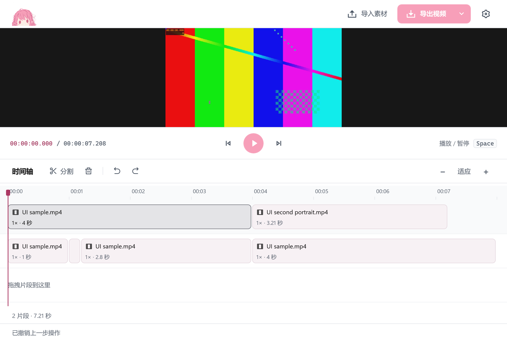

  
  <h1>Clip</h1>
  
轻量的 Windows 视频剪辑工具。拖入素材，剪出需要的片段，按轨道导出。

  

    <a href="https://github.com/OXeu/clip/actions/workflows/windows.yml">下载 Windows 版</a> ·
    <a href="https://github.com/OXeu/clip/blob/master/docs/usage.md">使用指南</a> ·
    <a href="https://github.com/OXeu/clip/issues">反馈问题</a>
  

## 界面预览

<!-- clip-ui-screenshots: run=35496187863; commit=880b408c8a3493a6c98454947d12f21417cbeee5; size=3024x2043; density=3x -->
<picture>
  <source media="(prefers-color-scheme: dark)" srcset="docs/images/screenshot-dark.png" />
  
</picture>

## 功能

- 分割、删除、拖拽排序，支持撤销与重做。
- 多个素材、独立轨道，每条轨道单独导出 MP4。
- 本机处理，不修改源文件；支持 NVIDIA NVENC 和 CPU 编码。

## 开始使用

Windows 10 / 11 x64，内置 .NET 和 FFmpeg，无需另行安装。

1. 登录 GitHub，打开上方下载链接，在默认分支最近一次成功构建的 **Artifacts** 中下载 `Clip-win-x64.zip`。
2. 完整解压，运行 `Clip.exe`。拖入视频，按 `S` 分割、`Delete` 删除，拖动片段调整顺序。
3. 点击轨道空白处选中整轨，再点击“导出视频”。

> 暂不支持保存剪辑项目，关闭前请先导出。当前发布包尚未签名。

## 文档与参考

[开发指南](https://github.com/OXeu/clip/blob/master/docs/development.md) · [更新指南](https://github.com/OXeu/clip/blob/master/docs/updates.md) · [第三方许可](THIRD-PARTY-NOTICES.md)

## 参与贡献

欢迎反馈问题、提出建议或提交 PR。开始前请阅读[贡献指南](https://github.com/OXeu/clip/blob/master/CONTRIBUTING.md)和[行为准则](https://github.com/OXeu/clip/blob/master/CODE_OF_CONDUCT.md)；[新建 Issue](https://github.com/OXeu/clip/issues/new/choose) 时可选择问题反馈或功能建议模板。

## 许可证

Clip 自有代码采用 [MIT License](LICENSE)。FFmpeg、Remix Icon、.NET 运行时等第三方内容仍适用各自的许可证，详见[第三方许可说明](THIRD-PARTY-NOTICES.md)。行为准则的许可和署名见其文末说明。
